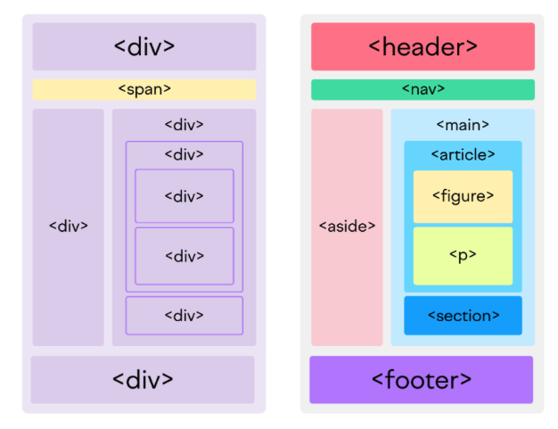

# HTML + CSS

- Semantic HTML. See: [article](https://www.freecodecamp.org/news/semantic-html5-elements/)

- **CSS Selectors**. See: [intro to selectors](https://developer.mozilla.org/en-US/docs/Learn/CSS/Building_blocks/Selectors). [selector reference](## [CSS Selector Reference](https://www.w3schools.com/cssref/css_selectors.php) ) [interactive demo](https://www.w3schools.com/cssref/trysel.php)
	- What is the difference between the `class1 class2` and `class1>class2` selectors?
	- How to style specially an item that has the property `selected`, e.g. `<li selected>Home</li>`?
	- What is the difference between `element [property]` and `element[property]`?
- **Cascading Stylesheets**. See [article](https://developer.mozilla.org/en-US/docs/Learn/CSS/Building_blocks/Cascade_and_inheritance)
	- What does it mean that the stylesheets are cascading? 
	- What has higher priority: the style for an element or for a class?
- **The Box Model**. See: [article](- [The box model](https://developer.mozilla.org/en-US/docs/Learn/CSS/Building_blocks/The_box_model))
	- What width does a block element take when it is not specified?
	- Do `width` and `height` elements apply to an `inline` element?
	- What is the default inner display type of a box? ([normal flow](https://developer.mozilla.org/en-US/docs/Learn/CSS/CSS_layout/Normal_Flow))

