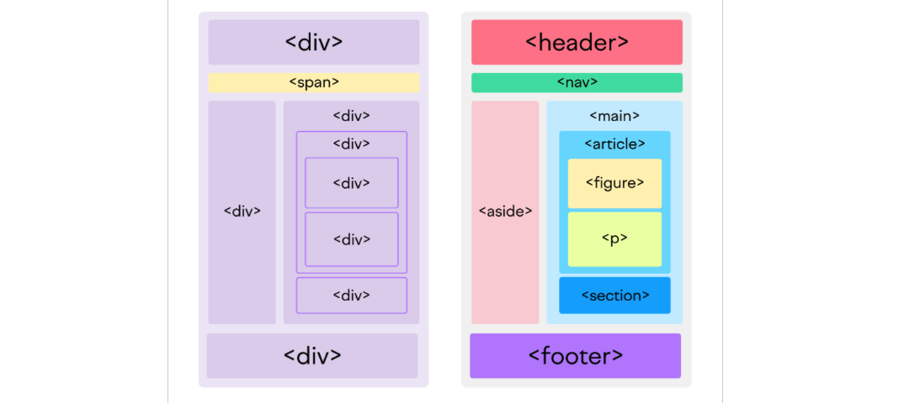

# HTML + CSS

Semantic HTML are a mew set of HTML tags that aim to be more expressive than just divs with classes ([article](https://www.freecodecamp.org/news/semantic-html5-elements/)).



Compare the following two snippets:

```text
<div id="header"></div>
<div class="section">
	<div class="article">
		<div class="figure">
			
			<div class="figcaption"></div>
		</div>
	</div>
</div>
<div id="footer"></div>
```

vs. 

```text
<header></header>
<section>
	<article>
		<figure>
			
			<figcaption></figcaption>
		</figure>
	</article>
</section>
<footer></footer>
```


# CSS Selectors

- [What is a selector? ](https://developer.mozilla.org/en-US/docs/Learn/CSS/Building_blocks/Selectors#what_is_a_selector)
- [How to apply the same style to a list of selectors?](https://developer.mozilla.org/en-US/docs/Learn/CSS/Building_blocks/Selectors#selector_lists)
- What happens when a selector is invalid? What happens when a selector from a list is invalid?

Types of selectors:
- [type, class, and id](https://developer.mozilla.org/en-US/docs/Learn/CSS/Building_blocks/Selectors#type_class_and_id_selectors)
- [attribute](https://developer.mozilla.org/en-US/docs/Learn/CSS/Building_blocks/Selectors#attribute_selectors)
- [pseudo-classes](https://developer.mozilla.org/en-US/docs/Learn/CSS/Building_blocks/Selectors#pseudo-classes_and_pseudo-elements) certain states (e.g. a:hover) and certain parts (e.g., p::first-line)
- [combinators](https://developer.mozilla.org/en-US/docs/Learn/CSS/Building_blocks/Selectors#combinators), e.g. `article>p`

[Demo](https://www.w3schools.com/cssref/trysel.php) of selectors in action

To Study at Home:  [selector reference](https://www.w3schools.com/cssref/css_selectors.php)

To answer at home: 
	- What is the difference between the `class1 class2` and `class1>class2` selectors?
	- How to style specially an item that has the property `selected`, e.g. `<li selected>Home</li>`?
	- What is the difference between `element [property]` and `element[property]`?


# Cascade and Specificity 

The **cascade** is an algorithm that defines how user agents combine property values originating from different sources: browser stylesheet, user-defined stylesheet, and website author stylesheet. Author stylesheet has precedence. 

[What is specificity in CSS and what is more specific: a class selector or an element selector?](https://developer.mozilla.org/en-US/docs/Learn/CSS/Building_blocks/Cascade_and_inheritance#specificity)
- see example

[What is inheritance?](https://developer.mozilla.org/en-US/docs/Learn/CSS/Building_blocks/Cascade_and_inheritance#inheritance)
- see example

Study: [article](https://developer.mozilla.org/en-US/docs/Learn/CSS/Building_blocks/Cascade_and_inheritance)

To answer: 
- What has higher priority: the style for an element or for a class? But a class or an id? 


# **The Box Model**. 

Everything in CSS has a box around it.

A block box in CSS has: content area, padding, margin, border: 


Two box models:
1. [Standard Box Model](https://developer.mozilla.org/en-US/docs/Learn/CSS/Building_blocks/The_box_model#the_standard_css_box_model): padding & border is added to the width & height
2. [Border-Box Model](https://developer.mozilla.org/en-US/docs/Learn/CSS/Building_blocks/The_box_model#the_alternative_css_box_model): content area width = width - padding & border


## Flow Layouts

Depending on the type, there are several types of outer display types. In what's called the  [Normal flow](https://developer.mozilla.org/en-US/docs/Web/CSS/CSS_flow_layout/Block_and_inline_layout_in_normal_flow) elements with the corresponding 
- display: inline -- layout horizontally (e.g. words in a paragraph).
- display: block -- layout vertically (e.g. paragraphs)
- display: inline-block -- layout block inside, and horizontally in the context


To study at home:

- [In Flow and Out of Flow](https://developer.mozilla.org/en-US/docs/Web/CSS/CSS_flow_layout/In_flow_and_out_of_flow)

## Challenge

Can you implement a CSS layout for a website that provides translations? It should add the translation above the original text as in the figure below. 


Start from the following HTML, and define the 

```
<html>
	<p>
	Zoom demande à ses salariés de <span class="trans"><span class="eng">to return face-to-face</span><span class="fr">revenir en présentiel</span></trans>
	</p>
	
	<p>
	En 2020, les revenus de l’entreprise <span class="trans"><span class="eng">had more than tripled<span class="eng"><span class="fr">avaient plus que triplé</span></trans> ; ils ont même continué d’augmenter en 2021, d’environ 55 %. Mais la progression a fortement ralenti l’année dernière : dans la période post-pandémie, la société de vidéo conférence a vu ses bénéfices chuter.
	</p>
	
</html>
```


- define a simple HTML page and play with CSS Selectors


