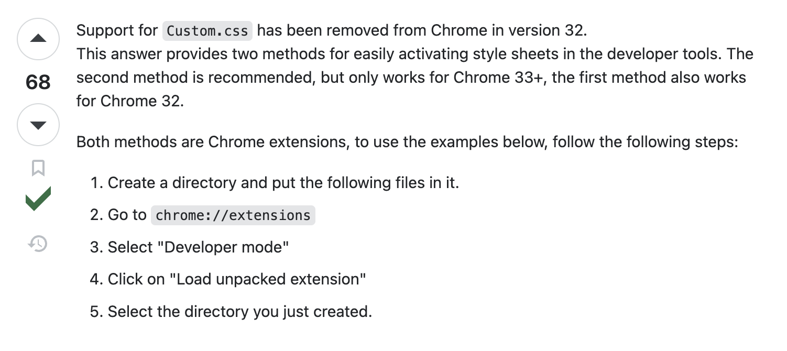

# Javascript & HTML

- The origin of Javascript: a language to implement little animations on web pages

- The DOM. See: [article](https://developer.mozilla.org/en-US/docs/Web/API/Document_Object_Model/Introduction)
	- What is the DOM? 
	- Can you manipulate it from HTML? 
	- How do you manipulate it from Javascript? 

- Introduction to Events. See: [article](https://developer.mozilla.org/en-US/docs/Learn/JavaScript/Building_blocks/Events)
	- What is an event handler function?
	- How do you add an event handler for clicking on an button?
	- Why is there sometimes a parameter `e` to the event handler? Should it be named `e`?


## Exercise

Implement an answer layout like the one you can find on StackOverflow for a single item. Implement  a voting component as 




# Javascript - The Language

With JS, as of 2023, you can building quite a few things: 
- dynamic web pages, web apps, 
- web servers (Node.js), 
- browser extensions, 
- services, desktop apps (electron), 
- mobile apps (React.js), 
- games (WebGL), IoT etc. 

Available on every device with a browser or a node.exe. 

Fast. 

Variants: TypeScript. 

## Language Basics
- [Language Basics](https://developer.mozilla.org/en-US/docs/Web/JavaScript/Guide/Grammar_and_types#basics)
	- Is JS case sensitive? Can you use unicode in identifier names?
	- What is the difference between `var`, `let`, and `const`?
	- What is block scope? What is the alternative scope?
	- How do you define a variable global to a file?
	- How do you define a variable that is only visible within a function scope? 
	- Difference between a global and a local variable?
	- What is the global object in the browser? 
	- [Data Types](https://developer.mozilla.org/en-US/docs/Web/JavaScript/Guide/Grammar_and_types#data_types)
	- What does it mean that JS is dynamically typed?
	- The `+` operator and numbers 
	- [How do you convert a string to a number](https://developer.mozilla.org/en-US/docs/Web/JavaScript/Guide/Grammar_and_types#converting_strings_to_numbers)?
	- Object literals? What is an object in JS?
- [Template Literals](https://developer.mozilla.org/en-US/docs/Web/JavaScript/Reference/Template_literals)
	- what are they?
	- what are they good for? 

- Expressions and Operators. [Comparison Operators](https://developer.mozilla.org/en-US/docs/Web/JavaScript/Guide/Expressions_and_operators#comparison_operators). [Logical Operators](https://developer.mozilla.org/en-US/docs/Web/JavaScript/Guide/Expressions_and_operators#logical_operators). [Ternary Operator](https://developer.mozilla.org/en-US/docs/Web/JavaScript/Guide/Expressions_and_operators#conditional_ternary_operator)
	- Why is there a `===` operator? 

## Functions

- [Functions](https://developer.mozilla.org/en-US/docs/Glossary/Function) [Arrow Function Expressions](https://developer.mozilla.org/en-US/docs/Web/JavaScript/Reference/Functions/Arrow_functions)
	- What is an immediately invoked function?
	- Anonymous function expressions?
- First-class functions [article](https://developer.mozilla.org/en-US/docs/Glossary/First-class_Function)


Can you parse this code?
```
someFunction(() => {
  console.log(`The user typed ${input}`);
}, [input]);
```

How do you parse this code?
```
someFunction(() => {
  console.log(`The user typed ${input}`);
  return () => {
    console.log("Bye!")
  }
}, []);
```


## Destructuring
- What is it? 
- How does this work?
- Have you seen it in other languages? 

Read: [Destructuring Assignment](https://developer.mozilla.org/en-US/docs/Web/JavaScript/Reference/Operators/Destructuring_assignment)

What's the output of each console.log?
```
let a, b, rest;
[a, b] = [10, 20];

console.log(a);

console.log(b);

[a, b, ...rest] = [10, 20, 30, 40, 50];

console.log(rest);
```

What's the output of this?
```
const obj = { a: 1, b: 2 };
const { a, b } = obj;
console.log(a)
console.log(b)
```

In many other syntaxes where the language binds a variable for you, you can use a binding destructuring pattern. These include:

- The looping variable of for...in for...of, and for await...of loops
- Function parameters
- The catch binding variable

Example of using it in a function definition: 

```
    const emp = {
        name: 'Bjørn',
        id: 1211,
        designation: 'Interaction Designer'
    };
 
    function getDetails({ id, designation }) {
        console.log(`Employee ID: ${id}, Designation: ${designation}`);
    }

    getDetails(emp);

```

One can use aliases to access the properties even:

```
    function getDetails({ id: empID, designation: desg }) {
        console.log(`Employee ID: ${empID}, Designation: ${desg}`);
    }

```

## Arrays


- [map](https://developer.mozilla.org/en-US/docs/Web/JavaScript/Reference/Global_Objects/Array/map) [filter](https://developer.mozilla.org/en-US/docs/Web/JavaScript/Reference/Global_Objects/Array/filter) 
	- [Spread Syntax](https://developer.mozilla.org/en-US/docs/Web/JavaScript/Reference/Operators/Spread_syntax) , e.g.`[...artists]`
	- immutable treatment of arrays
		- adding an element to an array with the spread operator: `[...artists, {id:"mich", name: "Michelangelo"}]`. Does it create a new array or not? 
		- removing an element from an array: `artists.filter(a => a.id !== "mich")`. Does it create a new array or not? 
	- mutable treatment of arrays
		- push, pop
		- ...
- [Modules](https://developer.mozilla.org/en-US/docs/Web/JavaScript/Guide/Modules) 


## Objects

What is this?

```
const FILTER_MAP = {
  All: () => true,
  Active: (task) => !task.completed,
  Completed: (task) => task.completed,
};
```

Can you create a list of objects `tasks` that would make the following code work? `FILTER_MAP.Active(tasks)`?

How do you get the list of the filter names?
```
const FILTER_NAMES = Object.keys(FILTER_MAP);
```


- How do you access the keys in an object / dictionary? 
