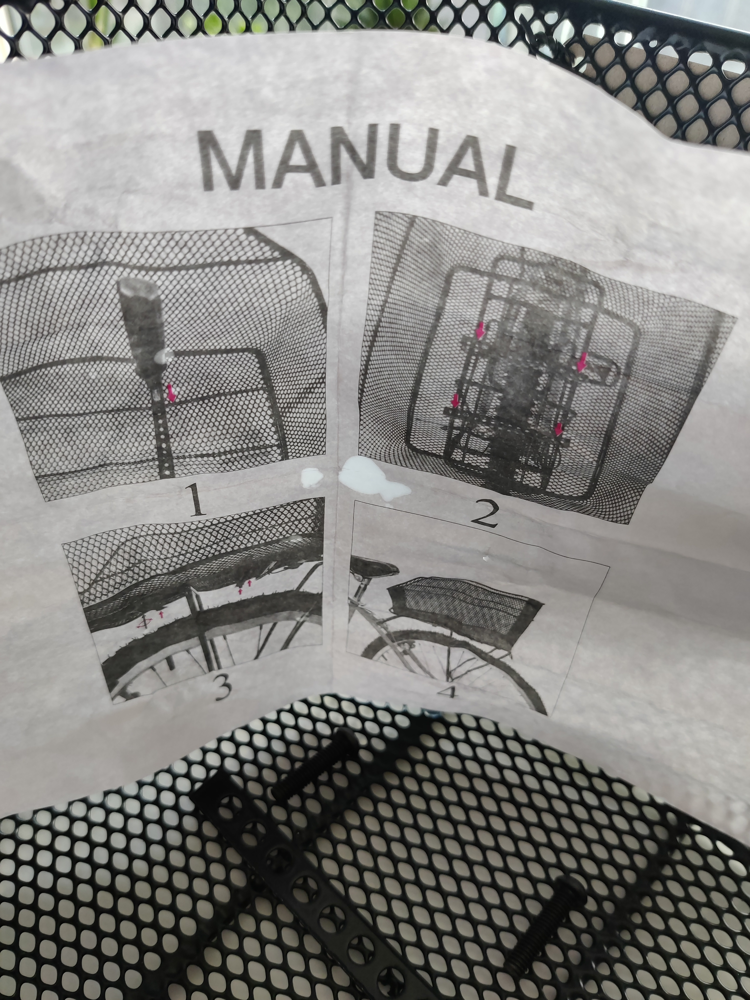

# Help and documentation

Even though it is better if the system can be used without documentation, it may be necessary to provide help and documentation. Any such information should be easy to search, focused on the user’s task, list concrete steps to be carried out, and not be too large.

## Examples

### Johanne
The aforementioned bicycle rear basekt comes with a very confusing and hard-to-read manual on how to mount the basket to your bicycle. The pictures are small and mono-chromatic with much visual detail that clutters the sections, the implied tool use is not always clear, and worst, it does not work as described.

