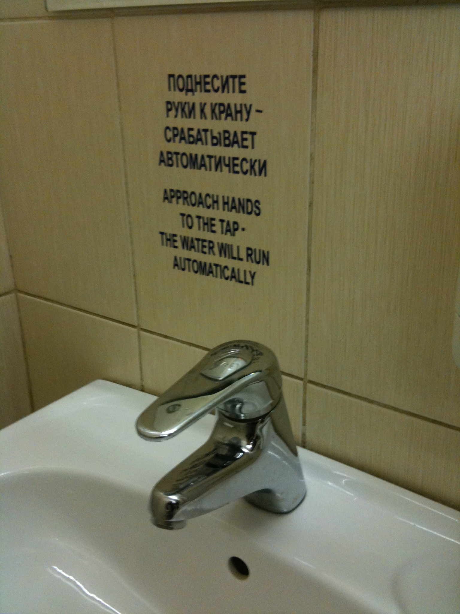

# Help and documentation

Even though it is better if the system can be used without documentation, it may be necessary to provide help and documentation. Any such information should be easy to search, focused on the user’s task, list concrete steps to be carried out, and not be too large.

## Examples

### Piotrek
Sorry, this is a funny one.
But even with very visibled ocumentation 
    (design and placement of it is questionable by itself)  
        it doesn't help when the documentation is attached to a wrong design? (^-^)

