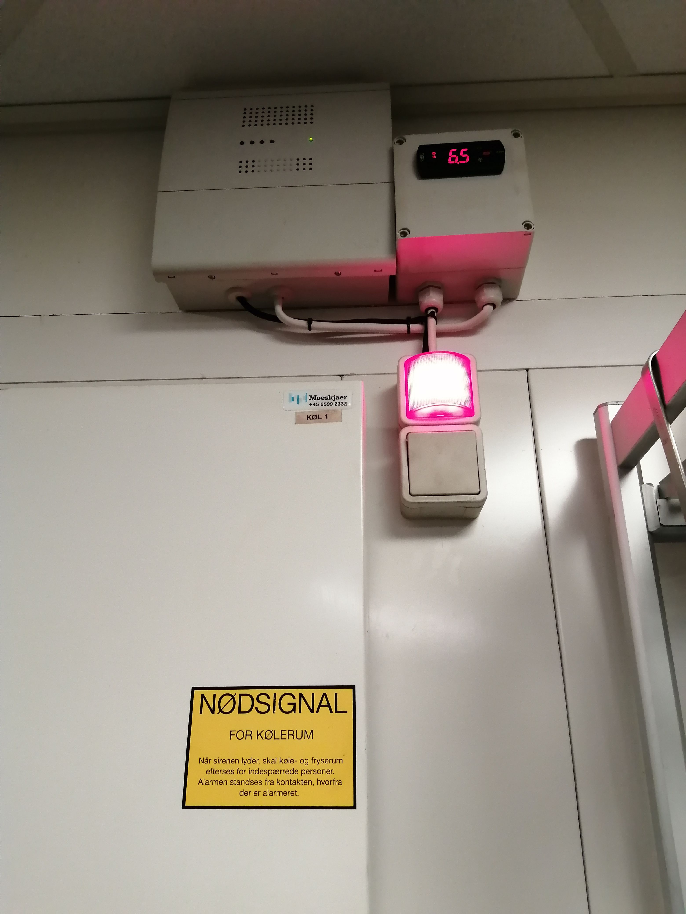

# Visibility of system status

The system should always keep users informed about what is going on, through appropriate feedback within reasonable time.

## Examples

### Mircea 
Miele Dishwasher lacks visibility of system status. It is not clear when it is running or not, even if there is a digital display. This is why somebody had to stick an external status gear, that now users have to manually update. Also, when first time users are looking at the display, it might seem like the dishwasher is running. But it is not - it simply shows the details of the currently selected programme.

### Bjørn
Elevator in the DR building does not tell me which floor it is on. It doesn't tell me if it's going up or down. Indeed, it is not even telling me which one is responding to me pressing the button!!! (I can tell by the sound that it is the right one.)

 

### Martin olsen (olse)
Nice and simple this does tell us the temperature of the room sized fridge.. however, 6.5 seems a little high. Is it actively cooling, and should one refrain from entering?
There are small icons, but they are too small to even identify. When zooming in, they become distinguishable, yet mean nothing to an unexperienced user, making this also fit into recognition. 
lastly, a big red light is on.. what does that mean? is it connected to the switch right below, and signal the electricity is on? or is it actually to alert us that the rooms is in fact not on.

 

