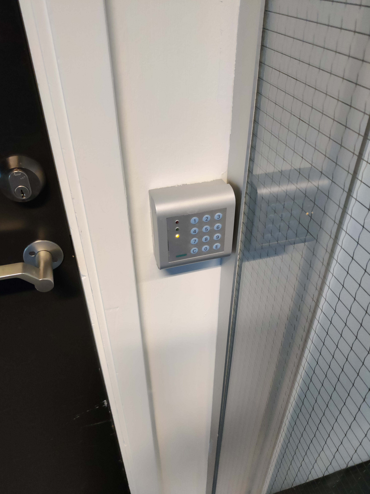

# Visibility of system status

The system should always keep users informed about what is going on, through appropriate feedback within reasonable time.

## Examples

### Mircea 
Miele Dishwasher lacks visibility of system status. It is not clear when it is running or not, even if there is a digital display. This is why somebody had to stick an external status gear, that now users have to manually update. Also, when first time users are looking at the display, it might seem like the dishwasher is running. But it is not - it simply shows the details of the currently selected programme.

### Bjørn
Elevator in the DR building does not tell me which floor it is on. It doesn't tell me if it's going up or down. Indeed, it is not even telling me which one is responding to me pressing the button!!! (I can tell by the sound that it is the right one.)

 

### Johanne
The access control card readers in the ITU building sometimes require the additional entering of the PIN associated with the scanned card on top of the initial scan, which then must be confirmed with the press of the "E" button. However, the readers do not tell you that. Its reaction to a card scan in this state is a "beep" upon scanning of the card, and then... nothing, instead of the usual green light and opening door. What is that supposed to mean? The scanner beeped, so it must have read the card, but the light isn't turning green. Is my card broken? Can I not access the building during nights/ weekends/ semester breaks?
The way I found out how to use these was by standing in front of the bycicle garage, trying to scan my card for a solid 5 minutes before another student showed up and explained to me that *this* was what the student ID PIN was for.

