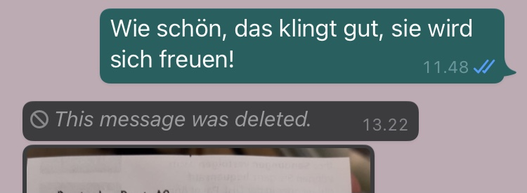

# Visibility of system status

The system should always keep users informed about what is going on, through appropriate feedback within reasonable time.

## Examples

### Mircea 
Miele Dishwasher lacks visibility of system status. It is not clear when it is running or not, even if there is a digital display. This is why somebody had to stick an external status gear, that now users have to manually update. Also, when first time users are looking at the display, it might seem like the dishwasher is running. But it is not - it simply shows the details of the currently selected programme.

### Bjørn
Elevator in the DR building does not tell me which floor it is on. It doesn't tell me if it's going up or down. Indeed, it is not even telling me which one is responding to me pressing the button!!! (I can tell by the sound that it is the right one.)

 

### Gina
When someone deletes a message on WhatsApp that has already been sent, then the following message remains in the chat: “this message was deleted”. The other person is then left wondering what the message was. I believe it is pointless design to display the “this message was deleted” message instead of actually deleting the message and any traces of it. This design causes confusion and leaves the sender feel awkward about their choice. 

 