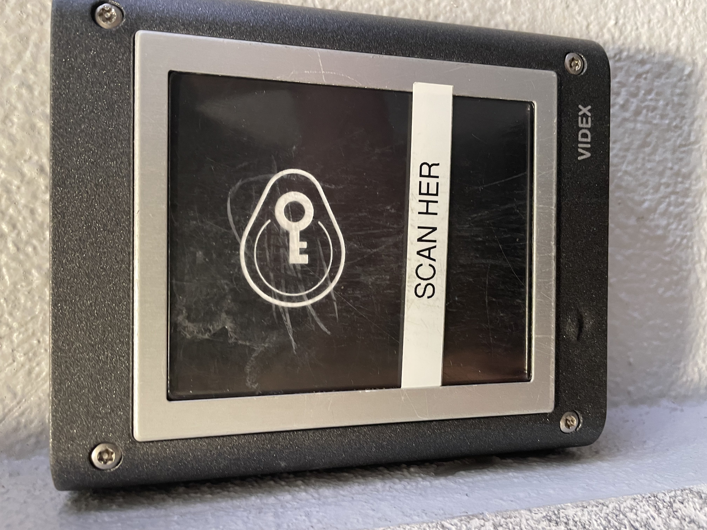

# Match between system and the real world

The system should speak the users’ language, with words, phrases and concepts familiar to the user, rather than system-oriented terms. Follow real-world conventions, making information appear in a natural and logical order.

## Examples

### Lars CLausen (lacl@itu.dk)

The convention would be, to place the chip, on the icon of the chip to unlock the door. However, the user has to scan below the icon. The Facility Management tried to be helpfull with "SCAN HER" dymo, but as seen by the scratchmarks - the user still keep trying to match the real-world chip with the pictogram of the chip.

