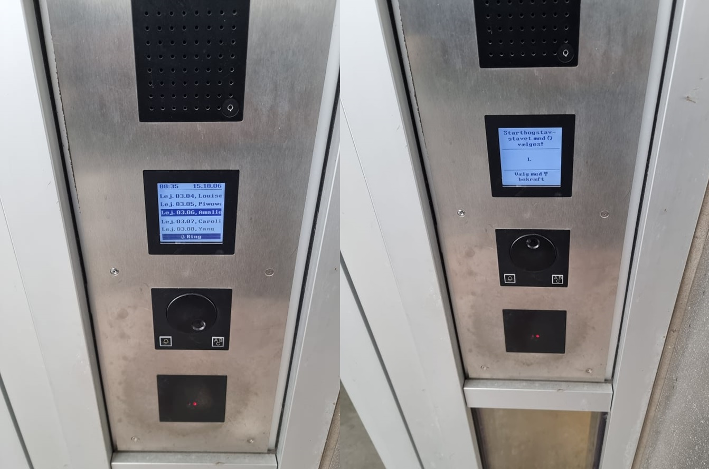

# Match between system and the real world

The system should speak the users’ language, with words, phrases and concepts familiar to the user, rather than system-oriented terms. Follow real-world conventions, making information appear in a natural and logical order.

## Examples

### Amalie F.P.
Doorphone at the building I live in has a wheel and two buttons. You use the wheel to turn through 220 different apartments (55 on each floor) with the risk of going too fast and missing the one you're looking for or going too slow and spending eternity turning the wheel. If you push the 'ABC' button you're taken to the screen on right. You might think you need to turn the wheel to choose due to the recycle symbol, but you have to use the 'ABC' button. It is not clear whether you then also confirm with the 'ABC' button (translation: choose with 'ABC' confirm). You cannot exit this menu, but have to wait for it to go back. The only thing that makes sense is the bell button you have to push to call the marked apartment.

 