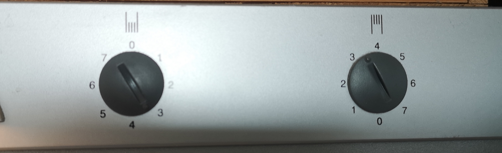

# Match between system and the real world

The system should speak the users’ language, with words, phrases and concepts familiar to the user, rather than system-oriented terms. Follow real-world conventions, making information appear in a natural and logical order.

## Examples

### Jakob

This is the controls on a refrigerator+freezer unit. The controller on the left controls the refrigerator and one on the right the freezer. But how are they to be understood? What does the values from 0-7 represent? Is it degrees, intensity or power? When manipulating the controls on a refrigerator we want to manipulate the temperature in the box, therefore thinking the numbers representing degrees (which they don’t). But if it represent intensity/power is the higher the number = warmer or colder? - Therefore a mismatch between system and real world.

