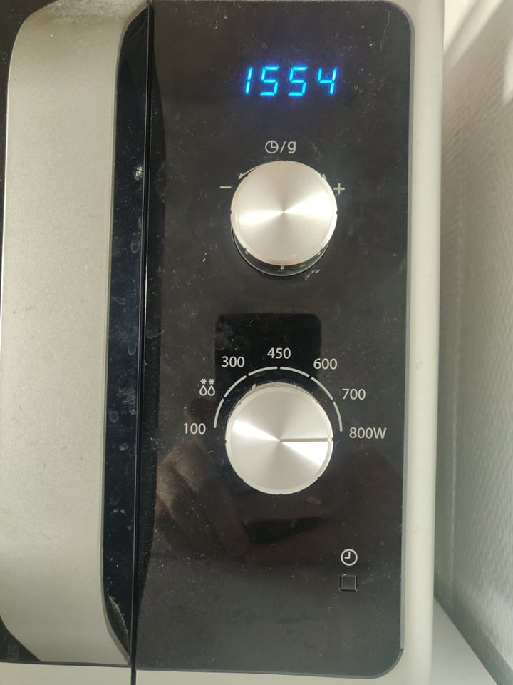

# User control and freedom

Users often choose system functions by mistake and will need a clearly marked “emergency exit” to leave the unwanted state without having to go through an extended dialogue. Support undo and redo.

## Examples

### Jonas
My microwave at home has a bad button system. Turning a knob to regulate power and time is fine, but how do you start it then? Press the only button, the clock, right? Wrong - that just starts a process to set the actual time of day on the microwave. Instead, you have to wait some seconds after providing the time and power, and then it starts. But everyone always clicks the button.

