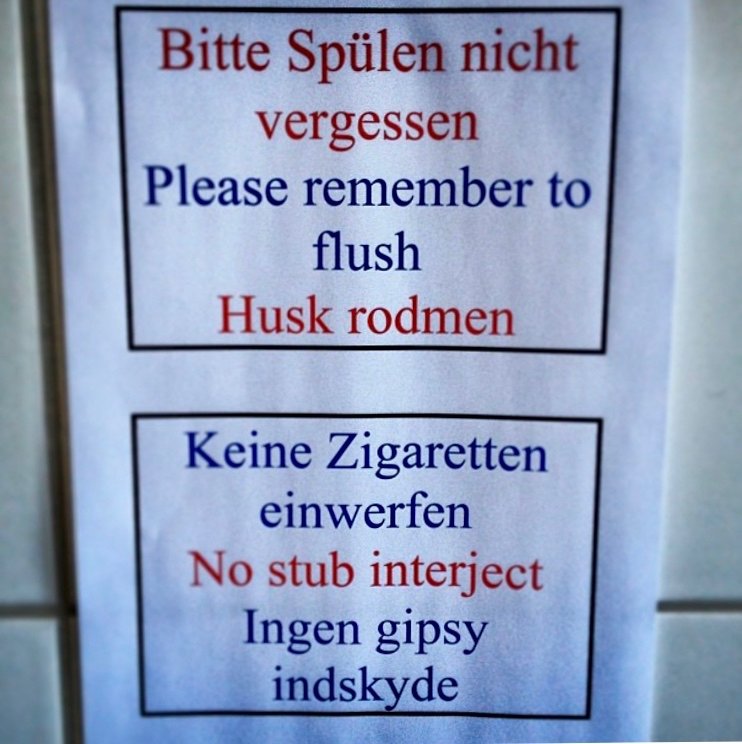

# Consistency and standards

Users should not have to wonder whether different words, situations, or actions mean the same thing. Follow platform conventions.

## Examples

### Piotrek
Once upon a time 'a band' rented a rehearsal space in Berlin. Their landlord had the idea that it was a Danish band, so they included instructions (of how to _not_ use a urinal) also in Danish language... at least they though so. 

