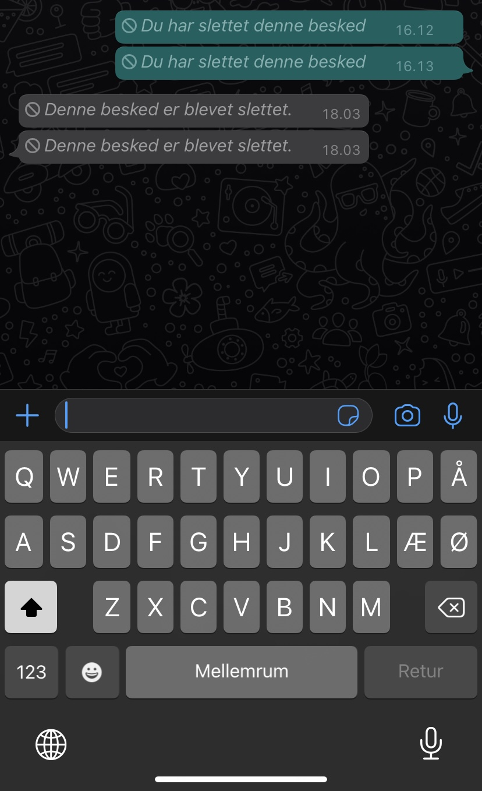

# Consistency and standards

Users should not have to wonder whether different words, situations, or actions mean the same thing. Follow platform conventions.

## Examples

## Klara
WhatsApp offers a "delete your message" function, but it only deletes the text - not the message in itself. The recipient will still be able to see the message, just with the text "This message has been deleted". But is this deleting a message? when the recipient still can see that there was a message that was sent - just not what it contained. Is this consistent with what other applications offer as the "delete your message" function?

 