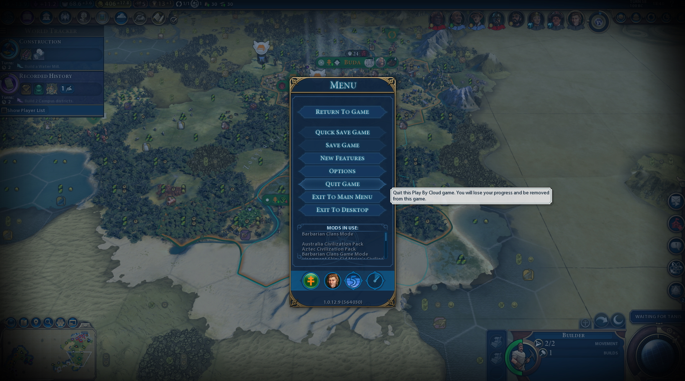

# Consistency and standards

Users should not have to wonder whether different words, situations, or actions mean the same thing. Follow platform conventions.

## Examples

The strategy game Civilization 6 allows for asynchronous online play, where players take their turns, exit the game, and are then sent a message when it is their turn again.
The verbiage used for this, however, is very unfortunate. In the pause menu of a match, the player can choose to "Exit game" or "Quit game".

Exiting the game means you are closing down your instance of it. Quitting a game means you withdraw your position in the game being played and forfeit any chance of playing it again.
In almost every other game, "quit game" and "exit game" are used interchangeably. The difference here has had a few players accidentally forfeit a game when they just meant to exit out of it after their turn.
The game does warn players and prompt them to confirm when they press "quit game" - but it also prompts players to confirm when they press "exit game" (as most games do), so most players would
probably just assume the confirmation window is a standard "are you sure you want to close this game?" and not read it.

Perhaps the verbiage "forfeit game" would make it clearer?

