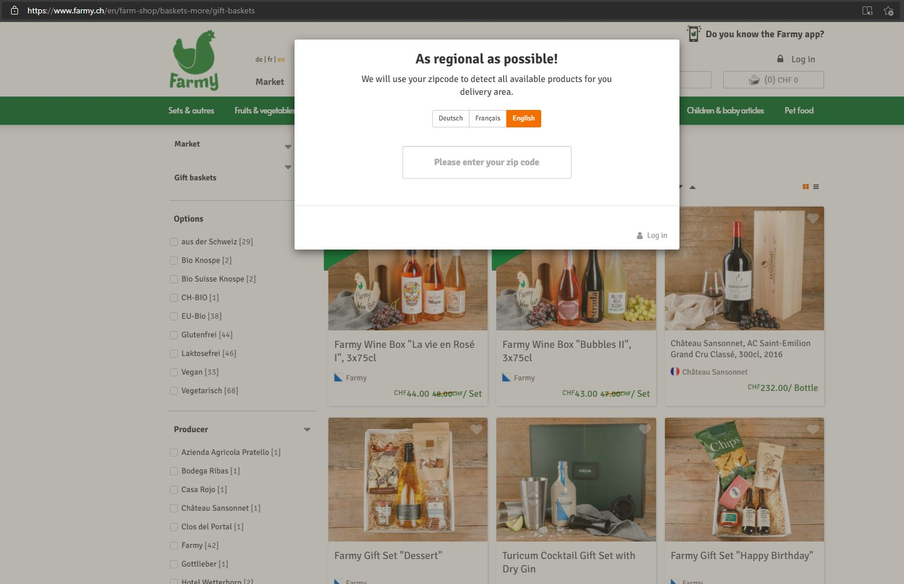

# Consistency and standards

Users should not have to wonder whether different words, situations, or actions mean the same thing. Follow platform conventions.

## Examples

### Teresa 
The website appears to have a appears modal dialog executing upon entering the site, i.e. a type of dialog box that you cannot ignore or close before you provide some information, in this case a zipcode. This is not consistent with good standards for making a website, because it makes it impossible to enter the website just to browse without giving away any personal information. The modal dialog simply disables the main content until the user explicitly interacts with it, and for this case tha assumption seems to be that a user only wants to interact with this website, if they are looking to buy the products in a certain area, forcing the user to either enter a zipcode or sign-in as a user.

This causes a lot of frustation for a user just wanting to browse the site, without giving away their geographical location or more personal information.

