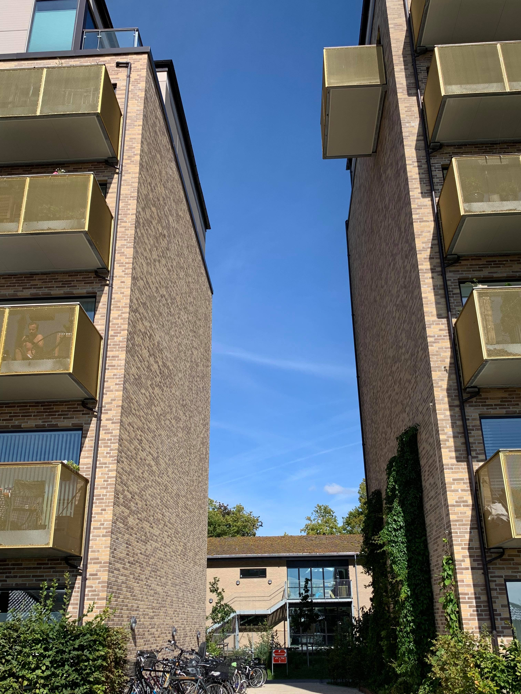

# Consistency and standards

Users should not have to wonder whether different words, situations, or actions mean the same thing. Follow platform conventions.

## Examples

### Teresa 
This picture is from a relatively new neighbourhood, 2017, and all buildings have been designed by architects.

In the picture we find a balcony that has been positioned all alone in between two large buildings. This does not appear to be very consistent to the other balconies,which are placed in a very organized pattern, or the overall design of the building.

When passing by and looking at it, it makes you wonder if this is a mistake, as it stands out as a weird position, because the place between two buildings like this is often very windy, cold and not very sunny. Furthermore, the view from the balcony is directly aimed at the neighbour accross which does not seem ideal either - all this wondering poses the question: why would anyone want a balcony at this position?

