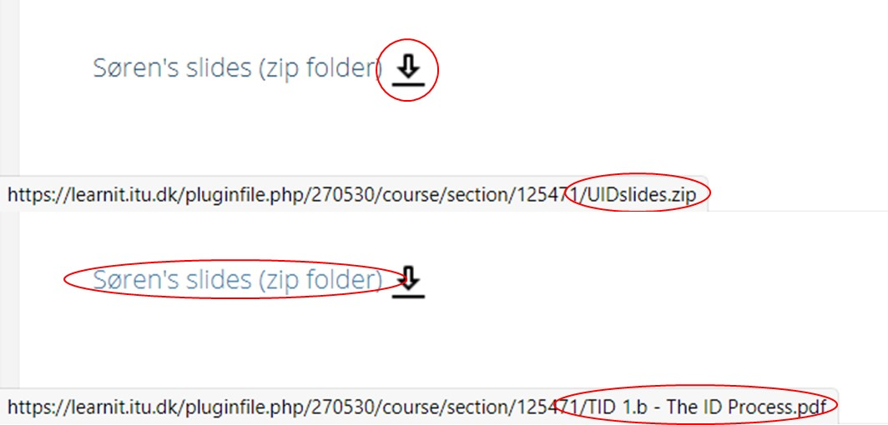

# Consistency and standards

Users should not have to wonder whether different words, situations, or actions mean the same thing. Follow platform conventions.

## Examples

### Niek 
On the TID LearnIT page there is inconsistency when it comes to the resources. Users have to wonder wether clicking a textual representation and an icon representing the resource mean the same thing, which it does not. And this goes against the standards on the LearnIT platform where an icon (which is normally before and not after the text), always refers to the same resource.

