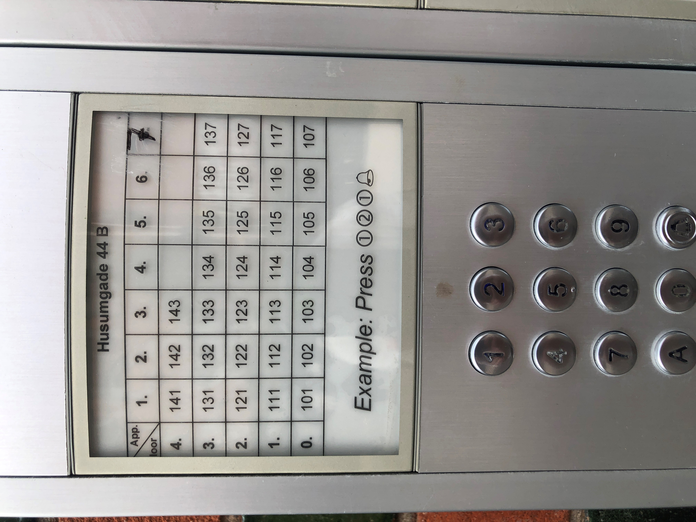

# Error prevention

Even better than good error messages is a careful design that prevents a problem from occurring in the first place. Either eliminate error-prone conditions or check for them and present users with a confirmation option before they commit to the action.

## Examples

### Sebastian 
The doorbell panel at Husumgade 44 is prone to errors by design. For instance a person trying to ring an apartment on the 3rd floor with the door number 2 might use the code 123 instead of 132. After inspecting the table in the attached image we can assume that the building's door numbers are displayed horizontally while its floor numbers are displayed vertically. This is not immediately evident from the drawing. To add to the fire, the word "floor" is partially cut off, which could then be confused with "door".

