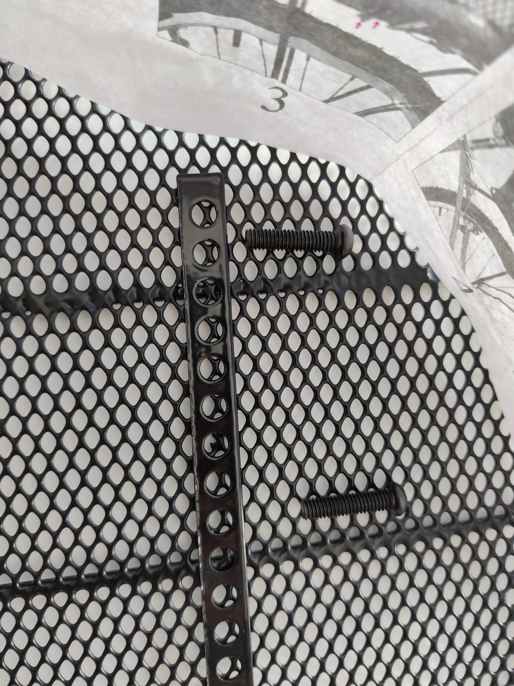

# Error prevention

Even better than good error messages is a careful design that prevents a problem from occurring in the first place. Either eliminate error-prone conditions or check for them and present users with a confirmation option before they commit to the action.

## Examples

### Johanne
This bycicle basket for the back wheel would be great - if you could actually mount it. It comes a couple of holed metal strips that perfectly fit the screws delivered with the product. Only one problem: The tight mesh of the basket is too fine to let the screws pass through, and the material is both too stiff and too flexible to bend it so they would.

