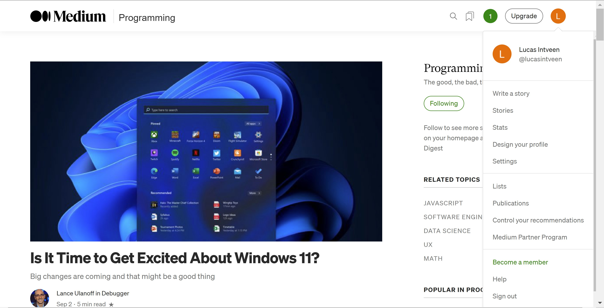

# Recognition rather than recall

Minimize the user’s memory load by making objects, actions, and options visible. The user should not have to remember information from one part of the dialogue to another. Instructions for use of the system should be visible or easily retrievable whenever appropriate.

### Lucas
When using Medium, it is not visible where and how I could create an additional post or see any statistics on my reading behavior. To do so, I am forced to click around and then find it below the name icon. There is no hints on how to find it. Therefore, I need to remember where to find it whenever I use it.

