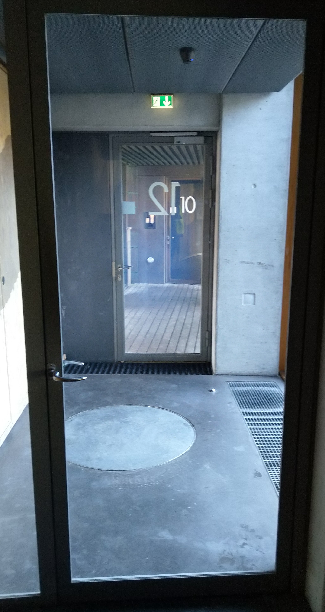

# Recognition rather than recall

Minimize the user’s memory load by making objects, actions, and options visible. The user should not have to remember information from one part of the dialogue to another. Instructions for use of the system should be visible or easily retrievable whenever appropriate.

## Examples

### Celine
These two doors have the same handle, but somehow should the first door be pushed and the next door should be pulled. Nothing indicate that they should be opened in different ways. Both of them made me do the exact opposite - especially when I enter from the other side. I can't remember which door that should be pushed or pulled.

