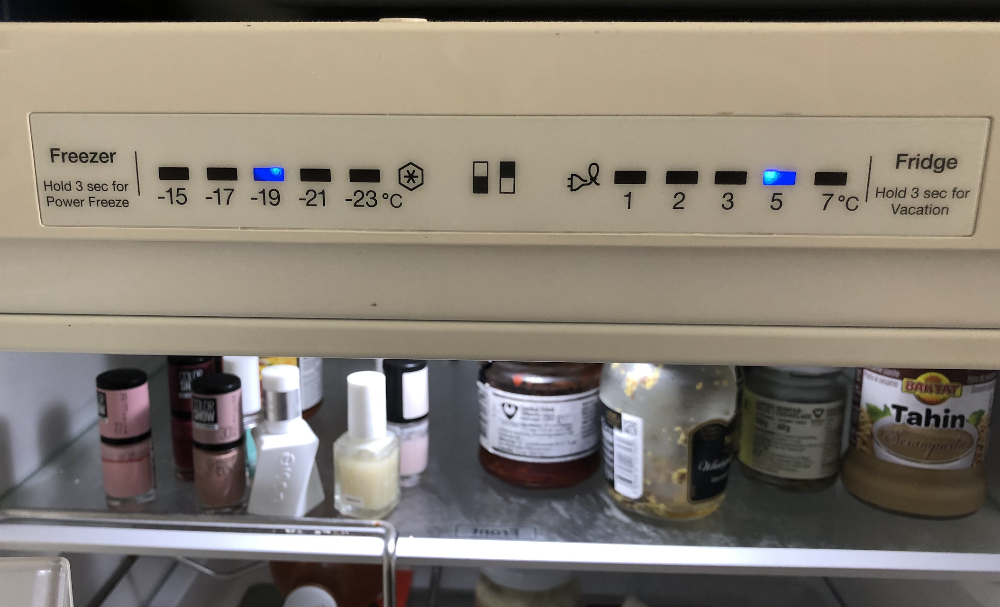

# Recognition rather than recall

Minimize the user’s memory load by making objects, actions, and options visible. The user should not have to remember information from one part of the dialogue to another. Instructions for use of the system should be visible or easily retrievable whenever appropriate.

## Examples

### Mia
The doorphone/intercom system doesn't tell what number to press in order to call up the right appartment. Logically, I would press in the appartment number, so if I live in 42.2.3, I would press 4223. But this is not correct. The number is actually 13.
There is no way for new people to know that number their appartment is, other than go through the whole library (200+ appartment numbers) on the intercom, until they find their appartment.
 

### Emma
After very light use, the buttons on my toaster disappeared (they should have made sure the icons were more permanent). For the last couple of years, I have just pressed a random button. I just realized, that the only button that actually means "toast this bread" is the last one. The one that is still visible, because I have never used it. I have been defrosting bread for years - apparently.

 

### Vera
My fridge shows me how many degrees the fridge and freezer are set to right now. It also tells me that I can: "Hold 3 sec for Vacation" I assume it's only for the fridge function since the message only stands below "Fridge". There's also a power plug icon which I don't know how to interpret. But the freezer also has a feature: Power Freeze. I'm not sure what "Vacation" or "Power Freeze" means in this context.

Also, it is not clear how to change the temperature in neither the fridge nor the freezer which I find a vital function when it comes to making sure that food is kept at the right temperature.

 