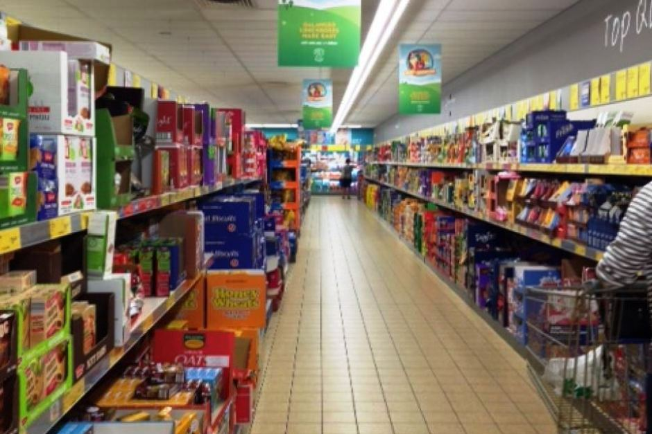

# Recognition rather than recall

Minimize the user’s memory load by making objects, actions, and options visible. The user should not have to remember information from one part of the dialogue to another. Instructions for use of the system should be visible or easily retrievable whenever appropriate.

## Examples

### Emma
After very light use, the buttons on my toaster disappeared (they should have made sure the icons were more permanent). For the last couple of years, I have just pressed a random button. I just realized, that the only button that actually means "toast this bread" is the last one. The one that is still visible, because I have never used it. I have been defrosting bread for years - apparently.

 

### Daniel Dencker Nilsson
When you go shopping in supermarkets you often forget what you came for and why. Furthermore, it is hard to remember the place of an item, due to the overload of items and colours, brandts, other people etc. Therefore, it requires a good memory when shopping. This is lost when you shop a new place, thus making it more time consuming. 

