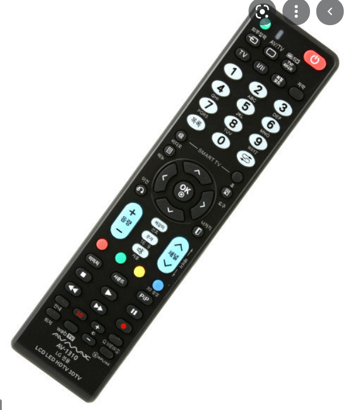

# Recognition rather than recall

Minimize the user’s memory load by making objects, actions, and options visible. The user should not have to remember information from one part of the dialogue to another. Instructions for use of the system should be visible or easily retrievable whenever appropriate.

## Examples

### Min
TV remote controllers in old days had a lot of buttons. While users use only limitied buttons on their daily lives, users had to figure it out what some buttons bring to their screen by trial and error. I assume it is better now after introducing smart TVs, where users can enjoy similar experience on TV as if they were playing on their computer. Followingly, remote controls got also simpler. 

 