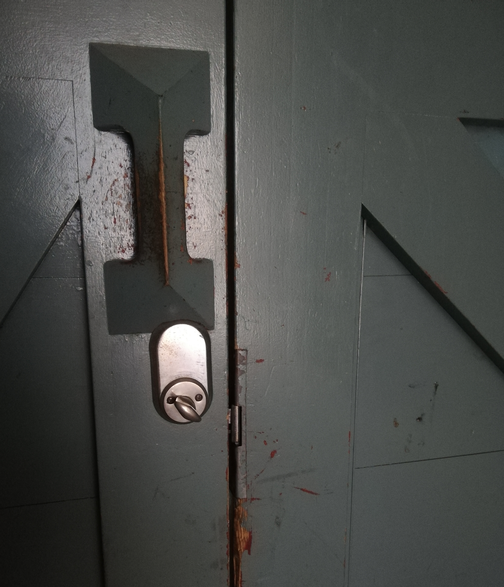

# Recognition rather than recall

Minimize the user’s memory load by making objects, actions, and options visible. The user should not have to remember information from one part of the dialogue to another. Instructions for use of the system should be visible or easily retrievable whenever appropriate.

## Examples

### Emma
After very light use, the buttons on my toaster disappeared (they should have made sure the icons were more permanent). For the last couple of years, I have just pressed a random button. I just realized, that the only button that actually means "toast this bread" is the last one. The one that is still visible, because I have never used it. I have been defrosting bread for years - apparently.

 

### Frida

This is the lock on the door to the yard of my building. It has to be turned in the opposite direction than the locks on the front and back doors, and also to the door to my apartment. Additionally, this lock has to be turned towards the lock mechanism when unlocking, making it counter-intuitive. This often results in me turning the lock in the wrong direction because I forget.

