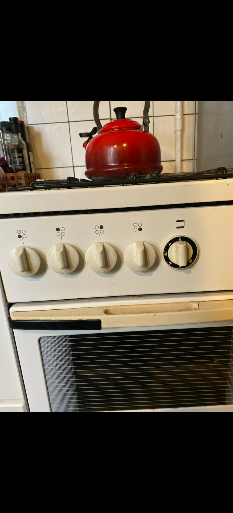

# Recognition rather than recall

Minimize the user’s memory load by making objects, actions, and options visible. The user should not have to remember information from one part of the dialogue to another. Instructions for use of the system should be visible or easily retrievable whenever appropriate.

## Examples

### Gustav
This artefact requires minimum memory load as the actions allowed by it are simple. The desing is outdated but follow most standard design of a stove/oven which hightens recognition as most users probably have seen a similar design. 

