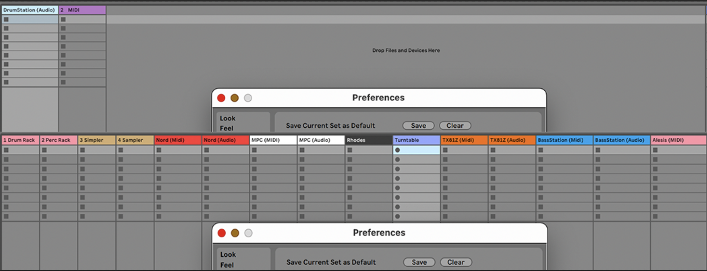

# Flexibility and efficiency of use

Accelerators — unseen by the novice user — may often speed up the interaction for the expert user such that the system can cater to both inexperienced and experienced users. Allow users to tailor frequent actions.

## Examples

### Daniel (dbrj)

Experienced users of the music production software Ableton Live are able to greatly alter the layout, color, signal routing and functionality of each individual audio channel specified to their requirements. The newly customized setup can then be permanently saved as the default layout by accessing the preferences of the software, such that every new project is executed with the given setup.

