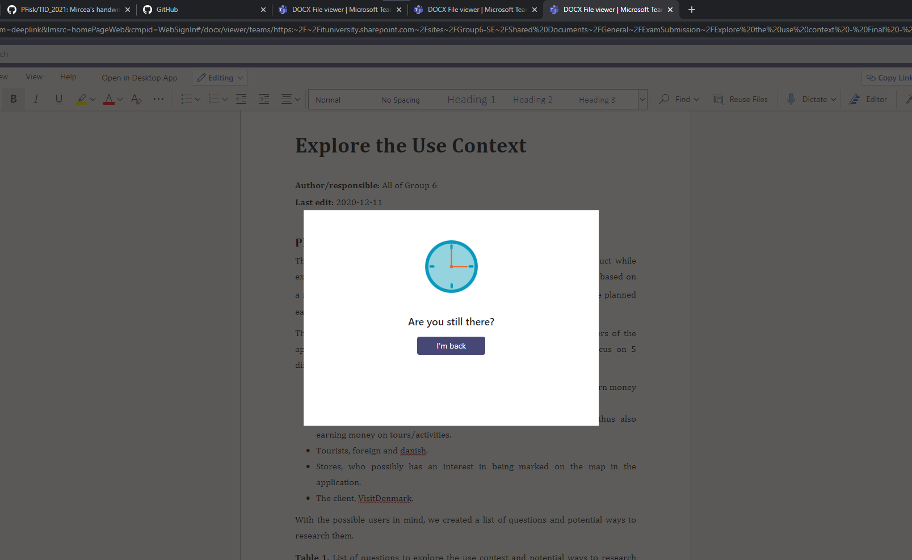

# Help users recognize, diagnose, and recover from errors

TError messages should be expressed in plain language (no codes), precisely indicate the problem, and constructively suggest a solution.

## Examples

### Philip Fisker
Microsoft Teams shows this message when having more than two tabs open at the same time. Although written in plain english, it is not very helpful. Pressing the "I'm back" button reloads the entire page, taking 2-5 seconds, while it at the same time makes the system display the message in one of the two other Teams tabs. It is there effectively impossible to work smoothly in more than two tabs of Teams.

 

