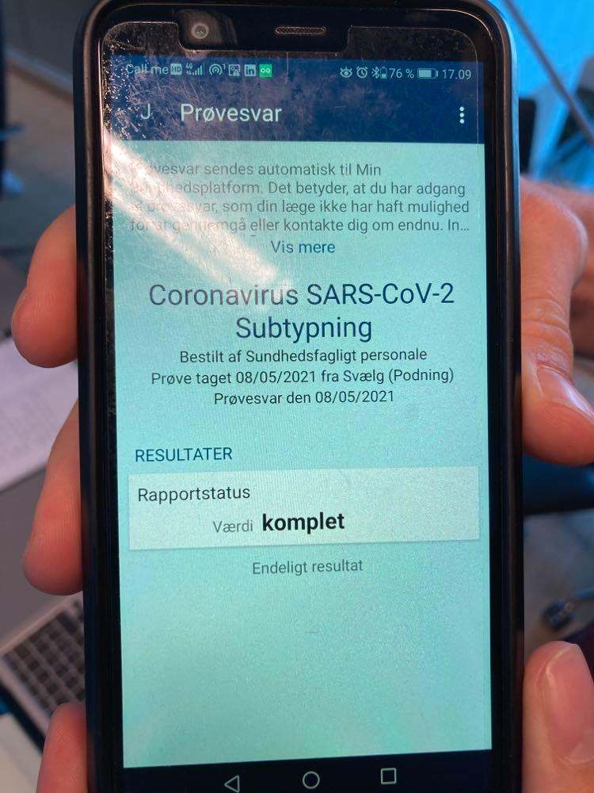

# Help users recognize, diagnose, and recover from errors

TError messages should be expressed in plain language (no codes), precisely indicate the problem, and constructively suggest a solution.

## Examples

### Jeppe examples
The image is also in conflict with principle 9, since I don't get any information about where to go to read the result or get help understanding the results. 

